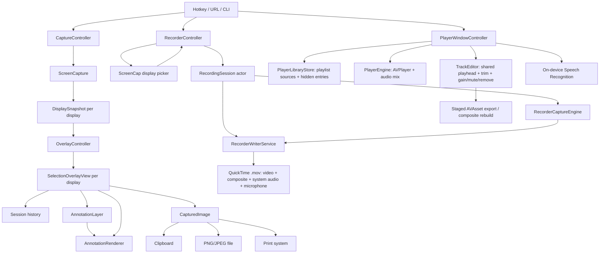
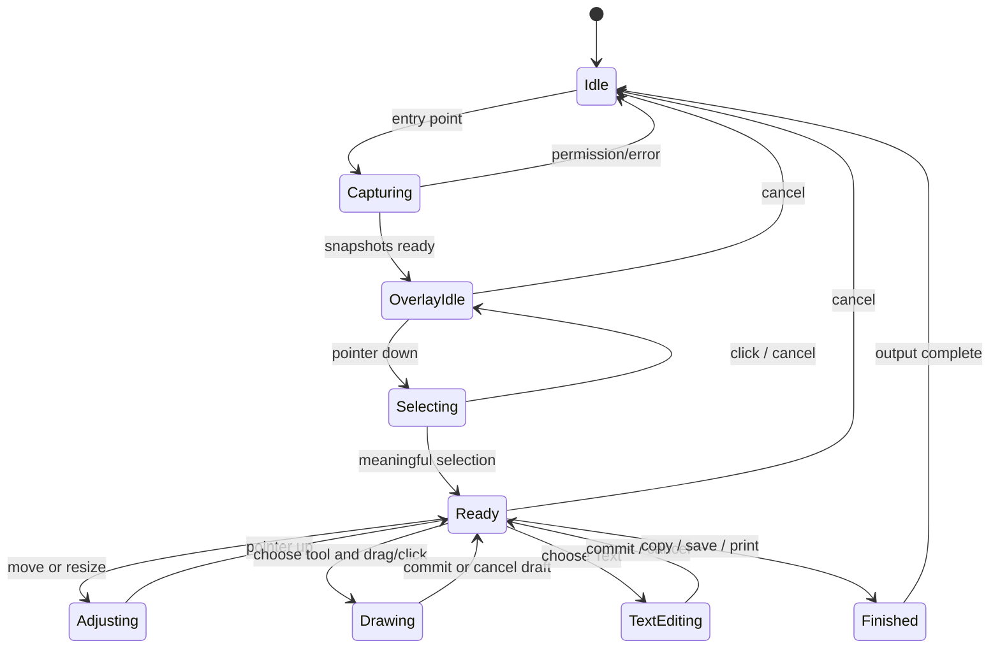

# ScreenCap architecture and product specification

This document is the engineering contract for ScreenCap 3.0.0. It describes what the
application does, which invariants must survive refactors, and which parts are tied to
macOS. It is intentionally more precise than the user-facing [README](README.md).

The repository currently contains a macOS implementation only. A Windows or Linux port is
not expected to copy AppKit classes one-for-one; it should implement the platform contracts
in [PORTING.md](PORTING.md) while preserving the product and rendering invariants below.

## Product contract

ScreenCap is an on-demand screenshot editor with a separate macOS 15+ recording mode. It
never uploads anything. A screenshot capture session follows this sequence:

1. Capture one frozen still for every currently available display.
2. Show a full-display overlay so the user can choose an area, a window, or a full display.
3. Let the user annotate the selected area in place.
4. Render the screenshot and annotations into one final image.
5. Copy, save, or print the image, then close the session.

An image can also enter the same editor through Finder. ScreenCap loads the image as a
preselected editing canvas, preserves its pixel dimensions for export, and leaves the
original file untouched. The second toolbar tool activates macOS VisionKit text analysis
for the selected area; it provides text highlighting, selection, `Cmd+A` and copying, but
does not edit the recognized text.

The recording mode is deliberately independent of that flow. It starts a ScreenCaptureKit
stream for the selected display, applies local level adjustment, peak limiting and optional gentle
RNNoise suppression to microphone samples, writes video plus system-audio and microphone samples
to one QuickTime movie, then post-processes a composite audio track to the first audio position
and finalizes the file on stop. It does not reuse the frozen screenshot, annotation overlay, or
image output pipeline. The fast path uses the display under the pointer; the alternate path uses
ScreenCap's own display chooser with a clear selected display and a transparent full-screen hit
layer, rather than Apple's content-sharing picker.

Finalization reports visible non-blocking stages (`Saving`, `Processing audio`, `Finalizing video`,
and `Checking recording`) through the menu-bar HUD. Optional composite-audio or strict-validation
failures do not discard a playable raw movie. The writer checks the original, temporary and
recovered sibling URLs, classifies a usable fallback as a warning/recovery result, and passes that
actual URL to the configured after-recording action; only a missing or unplayable movie is fatal.

The HUD remains the progress and fallback surface. Terminal results additionally go through the
local `SystemNotificationCoordinator`: warning/recovered/failure results are eligible even when
ScreenCap is frontmost, while an ordinary success is posted only when the app is inactive and no
after-recording action opened a destination. Authorization is requested lazily with alerts only;
there is no server, APNs registration, sound or badge. Notification actions resolve a bounded
local target identifier to a file path, so raw paths are not placed in notification payloads.

The post-recording action is intentionally unconfigured on a fresh installation. After the first
successful recording, the recorder presents a native choice pop-up; a selected action is persisted
and applied to later recordings. Choosing Later or closing the pop-up leaves the setting unconfigured,
so the prompt appears again after the next successful recording. An explicit Do nothing choice is
persisted and is therefore different from postponing the decision.

The Player is a separate module. It owns a persisted playlist of user-selected video files
and folders, reads media with AVFoundation/AVKit, and keeps edits in a view-model draft until
an explicit export. Its Track Editor uses one shared playhead for video thumbnails, composite
audio and raw audio lanes. Gain, mute, removal, trim, undo/redo and composite rebuild are
preview operations; staged export is the only write path. Removing a playlist item never
deletes its source. Speech transcription is an on-demand/opt-in automatic coordinator that
requires Apple's on-device Speech Recognition capability and reports unsupported locales or
missing permissions without a network fallback.

The supported entry points are:

| Entry point | Behaviour |
|---|---|
| Area | Start with no selection and rubber-band one area. |
| Repeat | Reuse the last selected global rectangle if it still intersects a display; otherwise start Area. |
| Window | Highlight an on-screen window under the pointer and select it on click. |
| Full screen | Preselect the display currently containing the pointer. |
| URL | `screencap://area`, `repeat`, `window`, `fullscreen`, `record`, `preferences`, or `about`. |
| Global hotkey | Configurable per action; defaults are documented in the README. |
| CLI | `--capture <mode>` including `record`, `--window <about\|preferences>`, and `--selftest <dir>`. |
| Player menu | **Open Player** opens the regular Player window; it is hidden at launch and can also open a video passed by Finder. |

Current intentional boundaries:

- A selection belongs to one display. It cannot span displays.
- Recording is currently macOS 15+ one-display-at-a-time. Display selection is available through
  the fast pointer path or ScreenCap's own dimmed display chooser; microphone source selection,
  pause/resume, countdown, camera, preview and HDR are not yet implemented. The microphone
  and system-audio toggles only affect ScreenCap's own tracks and preserve the original timeline
  with silence. The selected display remains visually clear in the chooser, but the transparent
  hit layer intercepts clicks so they cannot activate the application underneath.
- The current app has no automated UI-test suite. Rendering, geometry, encoding, and selected
  capture checks are covered by `--selftest`; interactive flows still need manual testing.
- macOS is the only implemented platform. See [PORTING.md](PORTING.md) for the target design
  and OS-specific capability limits.

## Runtime layers



The current source tree maps to these responsibilities:

| Layer | Current code | Responsibility |
|---|---|---|
| Application shell | `Sources/ScreenCap/App` | Accessory application, menu, URL events, About and Preferences. |
| Capture backend | `Sources/ScreenCap/Capture` | ScreenCaptureKit stills, display mapping, on-screen window enumeration, permission errors. |
| Session coordinator | `CaptureController`, `OverlayController` | Capture lifecycle, previous-app focus, one overlay per display, cross-display history. |
| Interaction/UI | `Overlay`, `UI`, `Preferences` | Pointer/keyboard input, selection chrome, tool strip, style popover, text editor, settings. |
| Domain model | `Annotations/Annotation.swift`, `OverlayTypes.swift` | Tools, styles, shapes, output actions, geometry and annotation ordering. |
| Rendering | `AnnotationRenderer`, `AnnotationLayer`, `ObfuscationSource` | One drawing path for live preview and final export; raster layer for erasing. |
| Output | `Output` | Clipboard, PNG/JPEG encoding, save panel, filename expansion, printing, feedback. |
| Recording | `Sources/ScreenCap/Recorder` | macOS 15+ ScreenCaptureKit stream, independent audio tracks, PTS normalization and QuickTime output. |
| Player | `Sources/ScreenCap/Player` | Playlist/library, AVPlayer playback, synchronized Track Editor, non-destructive trim/audio edits, staged export and transcription. |
| Persistence/localization | `Support/Settings.swift`, `L10n.swift`, `Resources/l10n` | User defaults, recent colors, hotkeys, language selection and fallback. |

The important future seam is between the domain/session layer and the platform shell. The
current files combine those concerns because AppKit is the only target. A port should keep
the domain model, state transitions, renderer rules, and acceptance tests independent of the
window system, then provide platform adapters for capture, windows, input, overlay, storage,
clipboard, dialogs, printing and packaging.

## Swift 6 build contract

The package uses Swift 6 tools and `.swiftLanguageMode(.v6)`. AppKit-facing controllers and
the Player/recorder view models are `@MainActor`; media work is staged through async
AVFoundation operations and explicit task boundaries. The current SDK still emits deprecation
and legacy AVFoundation callback sendability warnings on some Xcode versions. They are tracked
technical debt, not a reason to claim Swift 5 compatibility; CI requires a successful build
and the release checklist records the active toolchain.

The macOS 14 screenshot and macOS 15 recorder requirements are unchanged.

## Domain model

### Display snapshot

`DisplaySnapshot` is the immutable input to an overlay:

- stable platform display identifier;
- global display rectangle in logical desktop coordinates;
- captured pixel image;
- pixel scale derived from image pixels divided by logical width.

The snapshot must not change during a session. The overlay edits only annotations and
selection state; it never re-captures the screen while the user is working.

### Selection and annotations

Each `SelectionOverlayView` owns local state for one display:

- optional selection rectangle;
- ordered `[Annotation]` list;
- next numbering value;
- transient draft and text-editor state.

Coordinates inside an overlay are logical points with a bottom-left origin in the current
macOS implementation. Annotation order is meaningful: later annotations are composited after
earlier annotations, except that obfuscation deliberately composites the processed screenshot
under the existing transparent annotation pixels.

The annotation shapes are:

- pen and highlighter point paths;
- line and single/double-headed arrow;
- outlined or filled rectangle and ellipse;
- pixelation or blur in rectangle, ellipse, or brush form;
- numbered circle, optionally with an arrow from its centre;
- styled text;
- pixel eraser brush, rectangle, or ellipse.

Object eraser mode removes one complete non-eraser annotation from the ordered list. Pixel
eraser mode adds a destructive `destinationOut` operation to the annotation layer; it does not
delete the source vector annotation. This distinction is required for partial erasing,
undo/redo, and export.

### Tool style

`ToolStyle` is the complete style snapshot attached to each annotation. It includes stroke
color and width, shape fill, arrow heads, text size/backdrop/color, obfuscation style/shape/
intensity, eraser settings, and numbering settings. An annotation must not read current user
preferences while rendering: it uses the style captured when it was created.

The popover edits last-used defaults in `Settings`; the active overlay copies those defaults
into a `ToolStyle`. Recent primary and text-backdrop colors are separate FIFO lists, newest
first, with a maximum of nine entries each.

## Coordinate and pixel rules

Do not change these rules without updating the renderer and self-test together.

| Concept | Current rule |
|---|---|
| Global desktop | Cocoa logical points; origin is the lower-left of the virtual desktop. |
| Display frame | `NSScreen.frame` in global logical points. |
| Overlay view | One view per display, local logical points; origin is lower-left. |
| Annotation geometry | Overlay-local logical points. |
| Captured image | `CGImage` pixels; image crop coordinates use a top-left origin, so global-to-image cropping flips Y. |
| Pixel scale | Image pixel width divided by display logical width; normally 1× or 2×, but never assume either. |
| Export alignment | Selection is aligned to the display pixel grid before cropping. |
| Export resolution | Native pixel scale by default; logical 1× only when `downscaleRetina` is enabled. |
| Global rectangle | Used only to remember the last area and to move focus between displays; final image rendering uses the owning display's local selection. |

For another platform, define an equivalent `DesktopPoint`, `DisplayRect`, and `PixelImage`
contract instead of passing raw platform rectangles through the core. Every adapter must state:
the desktop origin, Y direction, logical-to-pixel scale, display rotation policy, and whether
coordinates can be negative.

## Capture-session state machine

The session coordinator is the owner of lifecycle and history. A view must not independently
decide when the session ends.



Rules that are easy to break:

1. A capture is single-shot. Never replace a session's frozen snapshots in response to a
   pointer move.
2. Starting a new selection on one display clears the active selection and annotations on all
   other display views. There is one chosen capture area per session.
3. A mutation pushes history **before** it mutates state. The state is the complete array of
   display states, not just the view receiving the event.
4. Undo and redo restore every display atomically and focus the display that contains the
   restored selection. Nudge operations coalesce into one step; history is capped at 64 steps.
5. Cancel discards the session. Finish first renders the image, then removes shielding overlay
   windows before showing save/print UI.

## Rendering and compositing invariants

`AnnotationRenderer` is the source of truth for both the live overlay and final export.
Changes that affect only one path are bugs.

The rendering order is:

1. Draw the frozen screenshot.
2. Draw a live obfuscation draft, if present, using normal/source-over compositing so it
   transforms screenshot pixels without erasing existing annotation pixels.
3. Draw the committed `AnnotationLayer`, clipped to the selection.
4. Draw a non-obfuscation draft or non-destructive erase preview.
5. Draw dimming, selection handles, badges, loupe and other chrome.

The committed annotation layer is a transparent bitmap rebuilt from ordered vector
annotations. Erase operations use destination-out on this transparent layer. The screenshot
itself must never be destination-out erased. On export, a new layer is rebuilt at the output
scale, then composited over the cropped screenshot. This is why the exported image stays crisp
and why a partial erase can be undone.

Redaction is not a reversible mask in the exported file: the final output contains only the
processed pixels. While the overlay is still open, the editable annotation layer means the
user can remove a redaction with the eraser; the UI and documentation must keep warning about
that workflow.

## Persistence and configuration

The macOS implementation stores settings in `UserDefaults` under the application domain
`com.vertusdesign.ScreenCap`. Persisted values include:

- hotkey bindings and preferred language;
- save directory, filename template, save format, copy-on-save and ask-where-to-save;
- dimming, loupe, selection-size badge, Retina downscaling and shutter sound;
- last-used tool styles, recent primary colors and recent backdrop colors.
- Player playlist sources and hidden folder entries (`player.library.sources.v1` and
  `player.library.hiddenRecordings.v1`). Player edits and transcripts are intentionally not
  persisted until the user exports a file.

The production app keeps the existing `com.vertusdesign.ScreenCap` defaults domain so a 3.0.0
update can retain v2 preferences and TCC decisions. `make app BUILD_FLAVOR=parallel` creates a
local QA bundle with `com.vertusdesign.ScreenCap.Pro3QA`; macOS then stores a separate defaults
domain and Screen Recording permission row. The parallel flavor is not an App Store identity.

Settings are preferences, not document data. Annotation history and captured pixels exist only
in memory for the active session. A port should use an explicit versioned settings document in
the platform's user-data directory and provide migrations; do not make the core depend on a
Windows registry, macOS defaults, or a Linux desktop's configuration service.

## Testing contract

The minimum automated checks for every platform implementation are:

- build the debug target successfully (SDK deprecation/sendability warnings are tracked in the
  current Swift 6 toolchain and are not treated as product failures);
- render every annotation type;
- verify obfuscation preserves annotations beneath it;
- verify PNG/JPEG encoding and filename-template expansion;
- verify coordinate conversions with negative display origins and different scales;
- verify hotkey serialization and invalid-binding handling;
- verify recent-color ordering, deduplication and the nine-entry limit;
- verify session history restores a selection after moving between display views;
- verify the final image uses the same compositing result as the live preview.
- inspect a valid movie, a video without audio, a file with only one audio stream, and a
  disappeared/unreadable source; the Player must reject non-video files without crashing;
- verify duplicate folder sources do not collapse the same file into one SwiftUI row;
- verify trim boundaries reject zero/negative ranges, removing the final audio track exports
  video-only, and composite rebuild leaves the source unchanged until commit;
- verify cancelled/failed Save Copy leaves an unsaved draft and playlist removal never deletes
  a source file;
- verify on-demand transcription requests Speech permission only on action, uses the on-device
  path, and reports denied/unsupported/no-audio/cancelled cases without network access;
- verify a second process cannot recover/move a movie whose marker PID is still alive, while a
  stale marker can be recovered after the owner exits;
- verify finalization can select a playable source, temporary or recovered sibling after optional
  composite-audio/strict-validation failure, reports a warning, and passes the selected URL to the
  after-recording action;
- verify stopping exposes persistent stage updates and dismisses the progress HUD on success,
  degraded success, cancellation and fatal failure;
- build both `production` and `parallel` flavors and inspect their bundle IDs and URL schemes.

The current executable exposes these checks through:

```bash
swift build
SCREENCAP_STRINGS=Resources/l10n .build/debug/ScreenCap --selftest /tmp/screencap-selftest
```

Interactive manual checks remain necessary for permission prompts, display transitions,
window highlighting, text editing, keyboard layouts, save/print panels, clipboard formats,
and accessibility. The manual matrix should include one Retina display, one 1× display,
negative display coordinates, two displays with different scales, and a non-Latin keyboard
layout.

## Release and source-of-truth rules

- `Package.swift` is the Swift package definition and declares the minimum macOS version.
- `Makefile` is the canonical local build/packaging entry point.
- `Resources/Info.plist` is a template; bundle identity, URL scheme, version, build and channel
  are substituted by `make`. Production is the App Store/update identity; `parallel` is QA only.
- `.github/workflows/ci.yml` is the canonical CI check list.
- `.github/workflows/release.yml` builds the universal DMG from a `v*` tag and publishes the
  DMG plus checksum.
- `CHANGELOG.md` records release history; `README.md` is user-facing documentation.
- This file is the architecture/product contract; [PORTING.md](PORTING.md) is the platform
  adaptation contract.

When behaviour changes, update the relevant contract and a self-test or acceptance scenario
in the same change. Do not document a proposed port as if it were already implemented.
